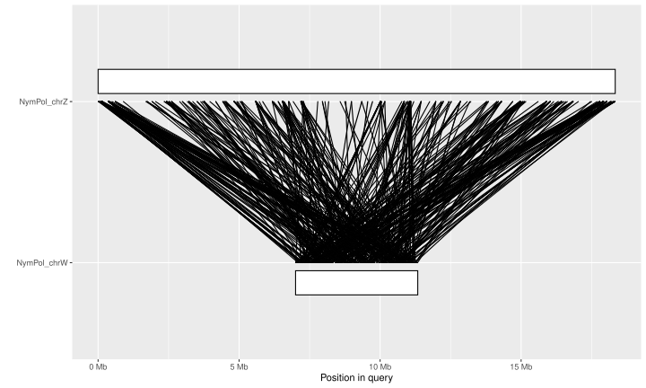
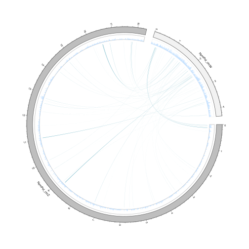
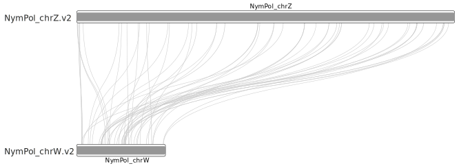

# nympahlis polychloros data  


## 1 - download data:

wget https://ftp.ebi.ac.uk/pub/ensemblorganisms/Nymphalis_polychloros/GCA_905220585.2/genome/softmasked.fa.gz

## 2 - reshape to insert some ID:

```sh
gunzip softmasked.fa
sed -i "s/>/>NymPhol_/g" softmasked.fa
samtools faidx softmasked.fa
```

## 3 - genome busco 

```
mamba activate busco6.0.0
input_fa=softmasked.fa
busco -c12 -o busco_"$input_fa" -i $input_fa -l insecta_odb12 -m genome
```

**results:**

---------------------------------------------------
    |Results from dataset insecta_odb12                |
    ---------------------------------------------------
    |C:99.5%[S:99.3%,D:0.2%],F:0.2%,M:0.3%,n:3114, E:6.1%      |
    |3098    Complete BUSCOs (C)   (of which 188 contain internal stop codons)                         |
    |3091    Complete and single-copy BUSCOs (S)       |
    |7   Complete and duplicated BUSCOs (D)          |
    |7    Fragmented BUSCOs (F)                       |
    |9    Missing BUSCOs (M)                          |
    |3114    Total BUSCO groups searched               |
    ---------------------------------------------------

awesome!

## 4 - gene annotation busco :

```
wget https://ftp.ebi.ac.uk/pub/ensemblorganisms/Nymphalis_polychloros/GCA_905220585.2/ensembl/geneset/2022_03/pep.fa.gz
gunzip pep.fa.gz
mamba activate busco6.0.0
input_fa=pep.fa
busco -c12 -o busco_"$input_fa" -i $input_fa -l insecta_odb12 -m protein

```

---------------------------------------------------
    |Results from dataset insecta_odb12                |
    ---------------------------------------------------
    |C:96.9%[S:68.0%,D:29.0%],F:1.7%,M:1.3%,n:3114      |
    |3019    Complete BUSCOs (C)                       |
    |2117    Complete and single-copy BUSCOs (S)       |
    |902   Complete and duplicated BUSCOs (D)          |
    |53    Fragmented BUSCOs (F)                       |
    |42    Missing BUSCOs (M)                          |
    |3114    Total BUSCO groups searched               |
    ---------------------------------------------------

there's a 3% difference with the genome! 

the genes file likely contain all alternative transcript. 

We can remove them with agat_sp_keep_longest_isoform.pl 

## 5 - can we do better with our workflow ?

**annotation using RNAseq + ODB12** 

here we use SLURM to process the data

**step by step procedure:**

**A ) trimm and map RNAseq read: (run time: ~2 hours)**
```
sbatch 00_scripts/slurm_code/01_submit_trimmomatic.sh 
sbatch 00_scripts/slurm_code/02_submit_gmap.sh NymPhol_Z haplo1 /scratch/qrougemont/01_nympol/softmasked.fa
sbatch 00_scripts/slurm_code/03_submit_gsnap.sh NymPhol_Z haplo1
```

**B) RepeatModeler (optional: genome is already masked - run time: 2days)**
```
sbatch 00_scripts/slurm_code/04_submit_repeatmodeler.sh -g /scratch/qrougemont/01_nympol/softmasked.fa -s NymPhol_Z -f haplo1
```

**C) Run braker (~one night)**
```
sbatch 00_scripts/slurm_code/05_submit_braker_RNAseq.sh -g /scratch/qrougemont/01_nympol/softmasked.fa -s NymPhol_Z -o haplo1 -r YES
sbatch 00_scripts/slurm_code/05_submit_braker_db_array.sh -g /scratch/qrougemont/01_nympol/softmasked.fa -s NymPhol_Z -o haplo1 -r YES
```

**D) reshape the output - run time: <1h**

```sh
sbatch 00_scripts/slumr_code/blabla.sh
```

**E) what is the busco ?**

---------------------------------------------------
    |Results from dataset insecta_odb12                |
    ---------------------------------------------------
    |C:97.4%[S:95.7%,D:1.7%],F:1.3%,M:1.3%,n:3114      |
    |3033    Complete BUSCOs (C)                       |
    |2981    Complete and single-copy BUSCOs (S)       |
    |52    Complete and duplicated BUSCOs (D)          |
    |40    Fragmented BUSCOs (F)                       |
    |41    Missing BUSCOs (M)                          |
    |3114    Total BUSCO groups searched               |
    ---------------------------------------------------

and after deduplication ?

---------------------------------------------------
    |Results from dataset insecta_odb12                |
    ---------------------------------------------------
    |C:97.3%[S:97.1%,D:0.2%],F:1.4%,M:1.3%,n:3114      |
    |3030    Complete BUSCOs (C)                       |
    |3023    Complete and single-copy BUSCOs (S)       |
    |7       Complete and duplicated BUSCOs (D)          |
    |43      Fragmented BUSCOs (F)                       |
    |41      Missing BUSCOs (M)                          |
    |3114    Total BUSCO groups searched               |
    ---------------------------------------------------

this is still very good - similar to the dataset provided the the Darwin Tree of Life

the duplication rate equals the duplication rate of the genome, which is good!

note: we could extract all missing BUSCO genes from the genome and add them manually to the prediction files 


**all in one procedure :**


## 6 - is there any strata ?

run code: 
opt="synteny_and_Ds"
sbatch 00_scripts/slurm_code/08_submit_genespace_paml_and_plot.sh "$opt"

* a minimap plot shows the extant of W reduction and rearrangements: 




* we obtained **ONLY** 49 single copy orthologues 


* the circos shows this:



HUGE GENE LOSS !

* same pattern observed in ideogram: 




* only few genes were available for dS computation


Therefore we did not analyzed the data further.  

Still this is an extrem case of genome degeneration


